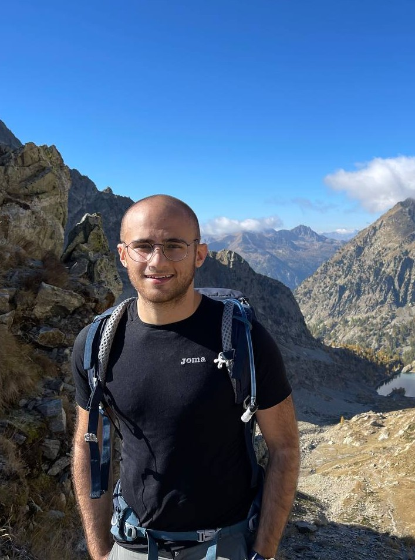
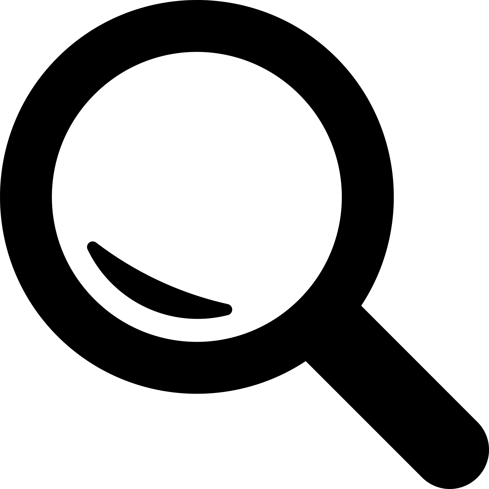

# Welcome!

I am **Francesco d'Amore**, a postdoctoral researcher at **Bocconi University** (Italy), working in professor [Luca Trevisan](https://lucatrevisan.github.io/)'s team.  
Previously, I was working in professor [Jukka Suomela](https://jukkasuomela.fi/)'s team at **Aalto University** (Finland).  

I earned my Ph.D. at **Université Côte D'Azur** (France) in the [COATI](https://team.inria.fr/coati/) joint project-team between Inria Sophia Antipolis - Méditerranée and the I3S Laboratory. My supervisors were [Emanuele Natale](https://natema.github.io/ema-webpage/) and [Nicolas Nisse](http://www-sop.inria.fr/members/Nicolas.Nisse/) (HDR).

---

## Contact Information

  
  

    <strong>Francesco d'Amore</strong> 
    Postdoctoral Researcher 
    Department of Computing Sciences, office 2-c2-06 
    Bocconi University, Milan, Italy 
    <a href="https://maps.app.goo.gl/QWWZPcZBChf3x9BR6">View on Map</a> 
    <strong>Email:</strong> francesco.damore2(at)unibocconi.it
  

---

## Research Interests

My research focuses on **distributed computing**, particularly on **randomized distributed algorithms**.  

I am interested in two key computing models:
- **LOCAL model**: Models with minimal restrictions on computational power and communication bandwidth.
- **GOSSIP model**: Models with strong restrictions.

### Current Projects
- Investigating **quantum communication** to explore its potential benefits (or limitations) in the LOCAL model.
- Developing and/or analyzing algorithms for the **consensus problem** and **collaborative search** in distributed systems.

### Additional Research
I also work on **theoretical machine learning** and statistics. For instance:
- Studying the **Random Subset Sum Problem** and its applications in understanding the efficiency of pruning (non-trained) neural networks.  
- Occasionally contributing to statistical analysis in **medicine** and **biology**.

---

Thank you for visiting my website! Feel free to reach out if you’d like to collaborate or learn more about my work.

  <!-- Image -->
  

  <!-- Credit Text -->
  

    Logo by <a href="https://www.vecteezy.com/" target="_blank" style="color: #007BFF; text-decoration: none;">Vecteezy</a>
  

